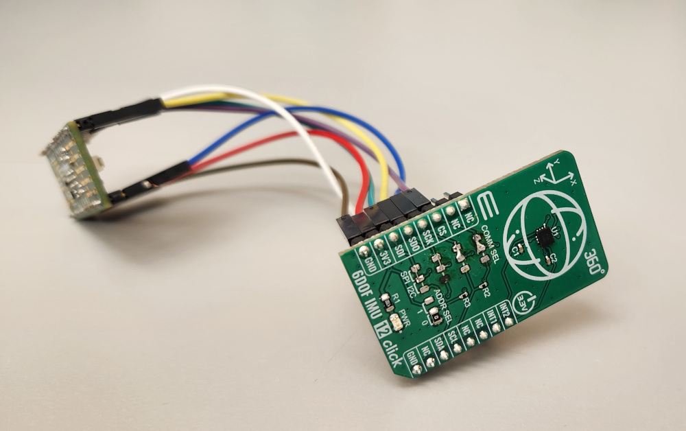

## About

This is a simple, header-only Arduino library for the Bosch BMI270 inertial
measurement unit using the SPI bus.  

## Use cases

I have tested this library on the following hardware:

* [MikroE 6DOF IMU 12 Click](https://www.mikroe.com/6dof-imu-12-click)
with [TinyPICO](https://www.tinypico.com/) ESP32 development board.

* MikroE 6DOF IMU 12 ClickJ with [Teensy4.0](https://www.pjrc.com/store/teensy40.html/) development board.

* [GEPRC-12A-F4 Flight Controller](https://geprc.com/product/gep-12a-f4-flight-controller-12a-esc/)

Note that for the MirkoE board you have to remove the zero-Ohm resistors on the
MikroE's I2 pads and solder a bridge across the adjacent SPI pads, as
shown in the photo above.

## Related projects

[Arduino\_BMI270\_BMM150](https://github.com/arduino-libraries/Arduino_BMI270_BMM150)
